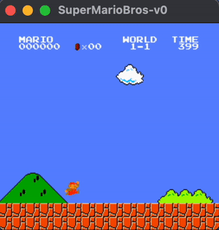

# Proximal Policy Optimization vs Rule Based Agent in Super Mario Bros

This repository contains code and documentation for the implementation and understanding of the Proximal Policy Optimization (PPO) algorithm applied to the game Super Mario Bros. Additionally, it includes an implementation of a rule-based agent for the game.



## Introduction

Proximal Policy Optimization (PPO) is a reinforcement learning algorithm that has received significant attention for its ability to offer more stable and reliable training compared to earlier policy gradient methods.

In this repository, PPO is utilized to train an agent to navigate and overcome the obstacles and adversaries in Super Mario Bros. For an in-depth understanding and practical examples of the implementation, please refer to the provided report.

Additionally, a Rule-Based Agent implementation is included to illustrate the differences between policy gradient methods and hard-coded approaches in handling a dynamic game environment.

## Getting Started

### Prerequisites

1. Python 3.x
2. [pip](https://pip.pypa.io/en/stable/)

### Installation

Follow these steps to get up and running:

1. **Clone the repository:**
    ```bash
    git clone <https://github.com/GooPoo/PPO_vs_RuleBased_Super_Mario_Bros.git>
    cd <PPO_vs_RuleBased_Super_Mario_Bros>
    ```

2. **Create a virtual environment:**
    ```bash
    python3 -m venv venv
    ```
    (Would highly recommend)

3. **Activate the virtual environment:**
    - **Linux/Mac:**
        ```bash
        source venv/bin/activate
        ```
    - **Windows:**
        ```bash
        .\venv\Scripts\activate
        ```

4. **Install the required packages:**
    Note: Different requirements for running PPO and Rule Based, use correct requirements for each method.
   - **PPO:**
        ```bash
        pip install -r PPO-Model/requirements.txt
        ```
    - **Rule-Based:**
        ```bash
        pip install -r RuleBased-Model/requirements.txt
        ```


5. **Directory structure**

    Ensure your directory is structured as below:


    ```
    ├── PPO_vs_RuleBased_Super_Mario_Bros/
    │ ├── PPO-Model/
    │ | ├── StablePPO.py
    │ | ├── run_model.py
    │ ├── RuleBased-Model/
    │ | ├── RuleBased.py
    ```

## Usage
- **PPO:**
    After setting up your environment and directory, you can train a PPO model using:
    ```bash
    cd PPO-Model
    python StablePPO.py
    ```

    This command will start training the model with the default hyperparameters. For detailed explanations of the parameters and the implementation, please refer to the report provided.

    Once trained, you can run the model with:
    ```bash
    python run_model.py
    ```
    Ensure you update the `model_path` in the script to point to the correct model file.
- **Rule-Based:**
    To run the rule-based agent, navigate to the appropriate directory and execute:

    ```bash
    cd RuleBased-Model
    python RuleBased.py
    ```
    Ensure correct environment and directory.